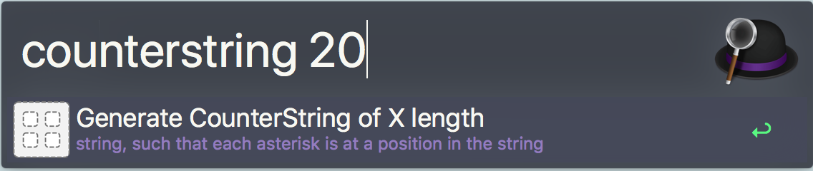

# alfred-counterstring
Create a counterstring that gets put in your clipboard

While I was recently attending a Testing conference, I heard about this concept of a counterstring and how useful they can be, so I did some research and found out more of what they were and how great they can be.  So I took what I learned from [James Bach](http://www.satisfice.com/aboutjames.shtml) specifically about what he called **Counterstrings: Self-Describing Test Data**(http://www.satisfice.com/blog/archives/22).  So I took that and turned it into a Alfred workflow. 

**[DOWNLOAD](https://github.com/donkidd/alfred-counterstring/releases)**

Once you download the workflow it can be called using (`counterstring`) followed by the length of the string you would like. 

So if `counterstring 20` were entered like above then the string `2*4*6*8*11*14*17*20*` would be saved into your clipboard to paste.

